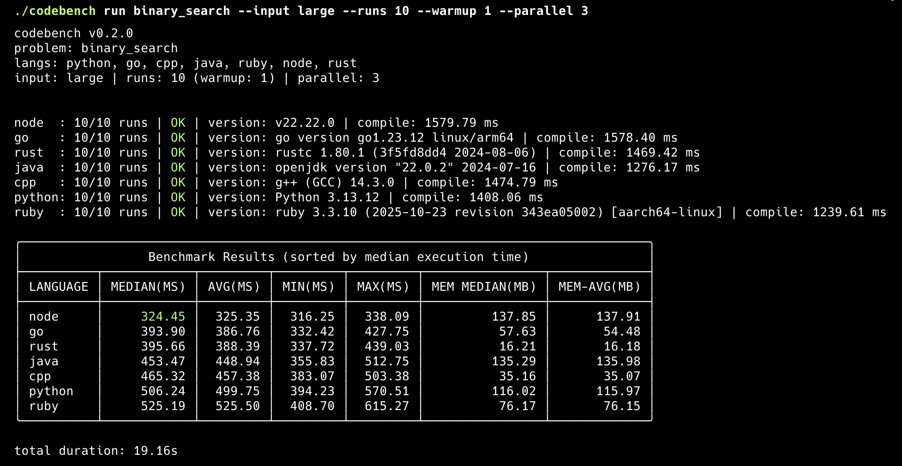

# CodeBench

**A production-grade CLI benchmarking tool that compares algorithm implementations across programming languages using Docker containers.**

CodeBench measures compile time and execution time separately, supports warmup runs, enforces timeouts, and produces statistical summaries — all in isolated, reproducible Docker environments.

## Why CodeBench?

- **Fair comparison**: Every language runs in its own Docker container — same environment, every time
- **Accurate measurement**: Separates compile time from execution time; warmup runs eliminate cold-start noise
- **Statistical rigor**: Reports median, average, min, and max across multiple runs
- **Reproducible**: Docker guarantees identical environments across machines
- **Failure-tolerant**: Failed languages are included in results — never silently skipped
- **Extensible**: Add new problems or languages by dropping files into the `problems/` directory

## Supported Languages

| Language | Docker Image             | Version Command   |
|----------|--------------------------|-------------------|
| Python   | `python:3.13-slim`       | `python --version`|
| Go       | `golang:1.23`            | `go version`      |
| C++      | `gcc:14-bookworm`        | `g++ --version`   |
| Java     | `eclipse-temurin:22-jdk` | `java -version`   |
| Ruby     | `ruby:3.3`               | `ruby --version`  |
| Node.js  | `node:22-slim`           | `node --version`  |
| Rust     | `rust:1.80`              | `rustc --version`  |

## Phase 1 Features

- Run benchmarks for a single problem across multiple languages
- Dockerized build and execution per language
- Configurable warmup and measured runs
- Separate compile time vs execution time measurement
- Median, Min, Max, Average statistics
- Timeout enforcement per run
- stdin-based input handling
- Deterministic input selection (small/medium/large)
- Language version detection
- Failure-tolerant results (all languages shown in table)
- Sorted table output (OK results by median, failures at bottom)

## Phase 2 Features

- **Parallel Execution Engine**: Run language benchmarks concurrently via goroutines using `--parallel N`.
- **Memory Tracking**: Peak memory captured dynamically across all measured runs using `time -v` entrypoint interception (outputs Memory Median and Average).
- **Structured Export**: Export run configurations, host metadata, and final execution metrics to `.json` or `.csv` files using the `--export` flag.
- **Metadata Capture**: Host CPU/OS diagnostics and Docker versions recorded for 100% reproducibility.

---

## Prerequisites

- **Go** 1.25 or later
- **Docker** installed and running

## Installation

```bash
# Clone the repository
git clone https://github.com/singhgautam7/Code-Bench---Language-Benchmarking-CLI-Tool
cd Code-Bench---Language-Benchmarking-CLI-Tool

# Build the binary
go build -o codebench .
```

## Usage

### Run Benchmarks

```bash
codebench run <problem> [flags]
```

### Flags

| Flag           | Default            | Description                                  |
|----------------|--------------------|----------------------------------------------|
| `--langs`      | all (from YAML)    | Comma-separated list of languages            |
| `--input`      | `small`            | Input size: `small`, `medium`, or `large`    |
| `--runs`       | `5`                | Number of measured runs per language          |
| `--warmup`     | `1`                | Number of warmup runs (excluded from stats)  |
| `--timeout-ms` | from `problem.yaml`| Timeout per run in milliseconds              |
| `--parallel`   | `1`                | Max number of concurrent language benchmarks |
| `--export`     | `""`               | Export results to file (`.json` or `.csv`)   |
| `--show-all-logs` | `false` | Show full Docker and command logs (disables progress bars) |

### Examples

```bash
# Run all 7 languages with defaults
codebench run binary_search

# Specific languages, medium input, 10 runs
codebench run binary_search --langs python,go,cpp,java --input medium --runs 10

# Export structured JSON data payload
codebench run binary_search --export results.json

# Run with Parallel Language Concurrency (batches of 3) and Export flattened CSV metrics
codebench run binary_search --parallel 3 --export report.csv
```

### Performance Notes
- **Parallelism Tradeoffs:** High `--parallel` values will dramatically reduce runtime but will increase contention for CPU resources.
- **CPU Contention Effects:** As concurrent containers compete for scheduling, execution measurements might inflate. For rigorous, absolute measurement precision, keep `--parallel=1`. Provide it greater than 1 purely for testing logic / relative comparisons at speed.
- **Reproducibility:** When benchmarking for reports, run synchronously or cap Parallel concurrency explicitly based on host core count to ensure fair metric baselining.

---

## 📚 Benchmark Problems

Our benchmarking philosophy centers around four core principles prioritizing architectural accuracy:
1. **Deterministic**: Every execution runs identical, non-random seeded data structures to ensure runs remain fundamentally equal.
2. **Reproducible**: Operations rely entirely on scoped static inputs avoiding network and dynamic system interactions.
3. **Idiomatic implementations**: Code leverages standard, native-language constructs representing conventional execution patterns (e.g. leveraging STL in C++, standard HashMaps in Java).
4. **Cross-language fairness**: All implementations strictly obey bounded $O()$ constraints representing identical data mutations without micro-optimizations or raw memory hacks.

### Numeric Algorithms
* `sum_of_n`: Absolute baseline accumulator loop ceiling.
* `fibonacci`: Iterative array loop counting simulating dynamic programming patterns.
* `factorial`: BigInt array multiplications stretching standard primitive constraints.
* `prime_count`: Memory-intensive `Sieve of Eratosthenes` boolean tracking.
* `matrix_multiplication`: Heavy $O(N^3)$ computational math parsing arrays of arrays.
* `gcd`: Euclidean remainder overhead testing modulus pipelines.

### String Algorithms
* `palindrome`: Large contiguous string reversions testing string equality speeds.
* `longest_substring`: Dynamic sliding window logic assessing map tracking boundaries.
* `string_concat`: Aggressive string re-allocation appending tests measuring immutable limits.

### Sorting / Searching
* `quicksort`: Stack-heavy recursive pointer swaps testing divide-and-conquer branching.
* `mergesort`: Large-scale continuous array heap allocation testing.
* `binary_search`: Sorted array halving sweeps.
* `linear_search`: Baseline contiguous array memory scanning.

### Graph Algorithms
* `bfs`: Standard Array Queuing network traversals.
* `dfs`: Callstack limit recursion network traversals.
* `dijkstra`: Priority-Queue shortest path heap allocations mapping edge weights.

### Data Structure Benchmarks
* `hashmap_insert`: Collision and structural reallocation load testing of core Map models.

### Parsing / IO
* `json_parsing`: Deserializing structured, nested tree logic heavily favoring language `std` libraries.
* `word_frequency`: Tokenizing large String arrays parsing into dynamic hash counts.
* `line_count`: Stdin IO buffer streaming tests slicing across `\n`.

> The README must always be updated whenever new commands, flags, features, languages, problems, or architectural changes are introduced. It is the single source of truth for usage and capabilities.

---

## Branding & Output Design

CodeBench employs an ultra-minimal, tool-like CLI aesthetic.



- **Compact Branding:** Bypasses heavy ASCII boxes or sprawling metadata dumps for deeply condensed layout headers mapping exact versions alongside your benchmarking configuration parameters.
- **Duration Summary:** Post-benchmark executions tally a `total duration` tracking overhead, accurately converting from `X.YYms` to `Z.WZs` relative decimal displays dynamically.
- **Subtlety in Performance Highlighting:** Scanning the clean output format, CodeBench visually isolates and surfaces the absolute winner algorithm. The lowest `Median(ms)` record belonging to an `OK` valid status sequence prints exclusively highlighted in ANSI green strings (`\033[32m`), optimizing read times.

---

## Output Modes

CodeBench hides messy Docker build traces, raw internal compiler warnings, and runtime environment noise by default, opting instead for a clean **Global Spinner**.

- **Quiet (Default):** CodeBench parses daemon executions actively in the background, rendering a minimalist `⠋ Benchmarking, please wait...` loader. We avoid percentage progress bars because Docker daemon pulls, cache resolutions, and compilation routines have implicitly volatile unknown durations.
- **Spinner Control:**
  - Standard implementations run the interactive `github.com/briandowns/spinner` package across multi-language metrics automatically.
  - `--no-spinner`: Provide this global toggle if you would prefer silent locks replacing the graphical loader.
  - **CI & System Overrides:** The spinner automatically aborts and defers to `--no-spinner` logging traits out-of-the-box if the execution environment carries `CI=true` global variables or the shell executes stripped of robust interactive TTY dimensions (`term.IsTerminal` checks).
- **Verbose Tracking:** To observe exact compilation bottlenecks, container crashes, or low-level metrics collection passing, append the verbose toggle enabling direct routing to `stderr` and `stdout`:

```bash
# Stream all Docker layer caches and container build pipelines live
codebench run binary_search --show-all-logs
```

> The README must always be updated whenever new commands, flags, features, languages, or architectural changes are introduced. It is the single source of truth for usage and capabilities.

---

## Output Format

The `run` command outputs benchmark results in two distinct, easy-to-read sections to separate dense metadata from clean execution statistics.

### Language Summary Lines
One line per language provides execution success rates, version details, and compilation timing cleanly. Color-coded status strings (`OK` in Green, `FAILED` in Red, `TIMEOUT` in Yellow, etc.) help triage executions immediately.
```text
cpp    : 3/3 runs | OK | version: g++ (Debian 14.2.0-8) 14.2.0 | compile: 457.29 ms
go     : 3/3 runs | OK | version: go version go1.23.6 linux/arm64 | compile: 521.16 ms
python : 3/3 runs | OK | version: Python 3.13.2 | compile: N/A
```

### Clean Performance Table
Following the summary lines, an exclusive metrics table renders deterministic results isolated from setup/build metadata to evaluate and diff algorithmic overhead safely.
```text
╭───────────────────────────────────────────────────────────────────────────────────╮
│                Benchmark Results (sorted by median execution time)                │
├──────────┬────────────┬─────────┬─────────┬─────────┬────────────────┬────────────┤
│ LANGUAGE │ MEDIAN(MS) │ AVG(MS) │ MIN(MS) │ MAX(MS) │ MEM MEDIAN(MB) │ MEM-AVG(MB)│
├──────────┼────────────┼─────────┼─────────┼─────────┼────────────────┼────────────┤
│ go       │     185.73 │  186.29 │  183.18 │  189.96 │           3.44 │       3.42 │
│ python   │     190.23 │  184.21 │  180.20 │  192.20 │           8.12 │       8.10 │
│ cpp      │     219.04 │  220.19 │  217.15 │  224.39 │           1.52 │       1.52 │
╰──────────┴────────────┴─────────┴─────────┴─────────┴────────────────┴────────────╯
```

---

## Status Values

Each language in the results table has a status:

| Status               | Meaning                                      |
|----------------------|----------------------------------------------|
| `OK`                 | Build and at least one run succeeded         |
| `BUILD ERROR`        | Docker image failed to build                 |
| `FAILED`             | Build succeeded but all runs exited non-zero |
| `TIMEOUT`            | Build succeeded but all runs timed out       |
| `NO SUCCESSFUL RUNS` | Build succeeded but all runs failed (mixed)  |

- **OK** results are sorted by median execution time (ascending)
- **Failed** results are shown at the bottom of the table
- Stats show `N/A` for failed/timed-out languages

---

## Adding New Problems

### 1. Create the problem directory

```
problems/
  your_problem/
    problem.yaml
    inputs/
      small.txt
      medium.txt
      large.txt
    python/
      main.py
      Dockerfile
    go/
      main.go
      Dockerfile
    # ... add more languages as needed
```

### 2. Define `problem.yaml`

```yaml
name: your_problem
input_mode: stdin
timeout_ms: 2000
languages:
  - python
  - go
  - cpp
  - java
  - ruby
  - node
  - rust
```

### 3. Create input files

Place input data in `inputs/small.txt`, `inputs/medium.txt`, and `inputs/large.txt`. These are piped to programs via stdin.

### 4. Implement solutions

Each language needs a source file and a `Dockerfile`. The program must:
- Read input from **stdin**
- Handle **EOF** cleanly
- Exit with code **0** on success
- Print the result to **stdout**
- Produce **deterministic** output

### 5. Run it

```bash
codebench run your_problem
```

---

## Adding New Languages

1. Create a directory under the problem: `problems/<problem>/<language>/`
2. Add the source file and a `Dockerfile`. Consider installing `time` package (GNU) inside stages for memory profiling support.
3. Add the language to `problem.yaml` under `languages:`
4. Add a version command mapping in `internal/benchmark/docker.go` (`versionCommands` map)

---

## Project Structure

```
CodeBench/
  main.go                       # Entry point
  cmd/
    root.go                     # Cobra root command
    run.go                      # Run subcommand + table rendering
  internal/
    benchmark/
      docker.go                 # Docker build, run, version detection, memory parsing via injection
      runner.go                 # Benchmark orchestration (failure-tolerant) + Parallel Goroutine Map
      stats.go                  # Statistical computations for Time / Memory structs
      metadata.go               # Host configuration resolution Payload
    problems/
      loader.go                 # Problem YAML loader
      types.go                  # ProblemSpec type definition
    export/
      json.go                   # Encodes structured result payloads to memory
      csv.go                    # Map structured values into flat table format
  problems/
    binary_search/              # Example problem
      ...
```

---
